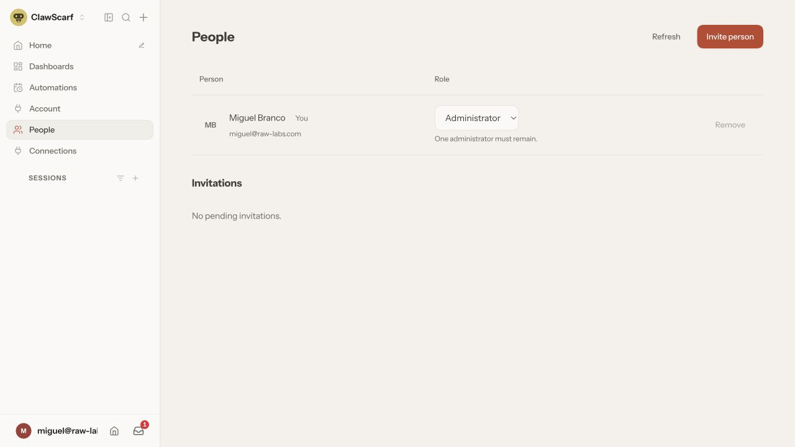
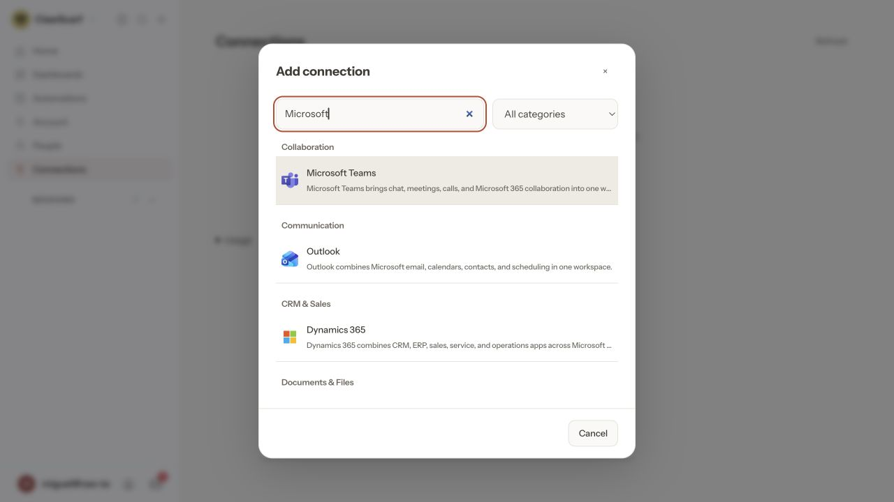
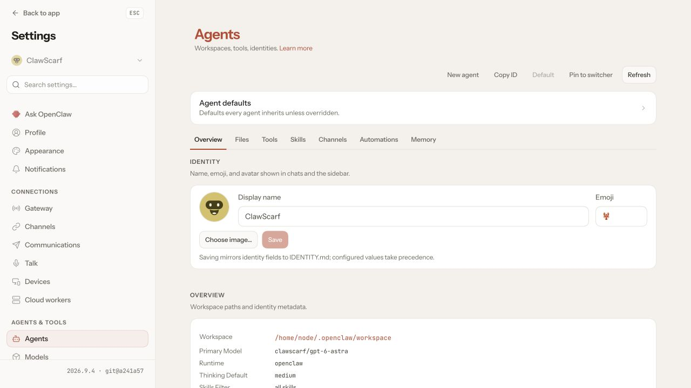
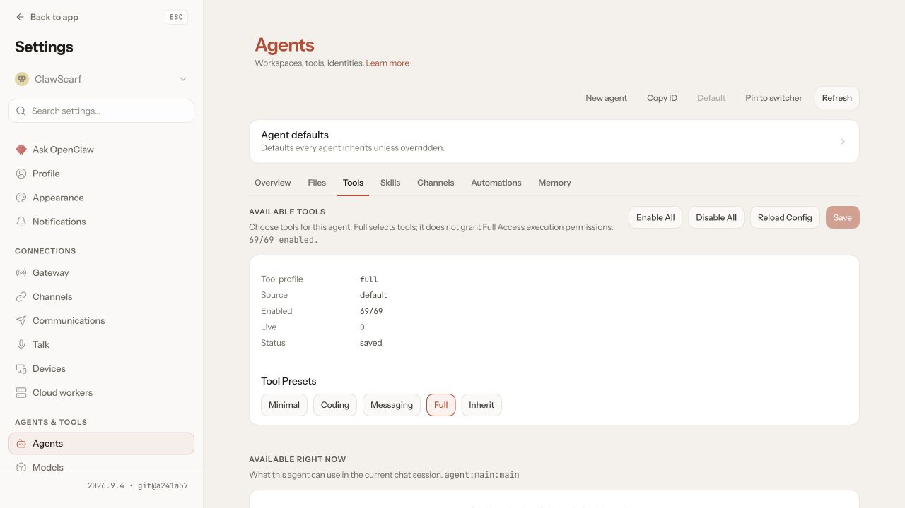
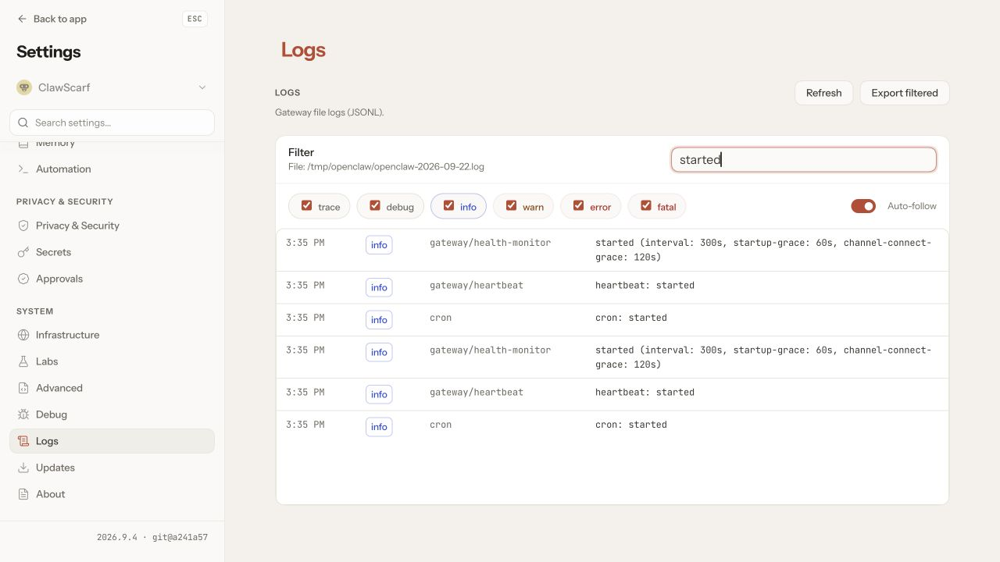

<a href="https://clawscarf.com"></a>

# ClawScarf

### OpenClaw, ready for your team.

Give your team a shared OpenClaw server—with company SSO, individual roles,
enterprise connectors, your choice of AI models, and execution protected by
NVIDIA OpenShell.
**Self-hosted. Open source. OpenClaw’s own interface.**

[Get started](#get-started) · [See the product](#see-the-product) · [Installation guide](deploy/deployment/installation.md) · [Releases](https://github.com/clawscarf/clawscarf/releases) · [Contribute](CONTRIBUTING.md)

- **Bring your team:** use hosted login or your company's SSO through OIDC, then
  manage invitations, native roles and access in **People**.
- **Connect your work:** enable **Connections** for services such as Microsoft Teams,
  Outlook, SharePoint, Salesforce and Slack. Link accounts and choose which agents
  can use them. Connections is optional and independent of login.
- **Keep OpenClaw:** work with its native agents, conversations, tools and settings.

## Get started

```sh
curl -fsSL https://github.com/clawscarf/clawscarf/releases/download/v0.1.0-alpha.14/install.sh | sh
export PATH="$HOME/.local/bin:$PATH"
clawscarf configure
```

**Choose Personal assistant or Team server. Pick a model. Sign in. Start your server.**

The terminal setup walks you through it, downloads the runtime, and opens OpenClaw
in your browser. Your sign-in becomes the first administrator account. No checkout,
Docker configuration files or separate OpenClaw installation required.

You’ll need Docker and a model-provider API key. Check the
[platform requirements](deploy/deployment/installation.md) before installing.

<details>
<summary>Prefer npm?</summary>

```sh
npm install -g @clawscarf/cli@next
clawscarf configure
```

This alternative uses your own Node installation; see the
[requirements](deploy/deployment/installation.md).

</details>

## See the product

Real screenshots from a running local installation with Connections enabled.

### People: team access and native roles

Invite teammates, assign OpenClaw roles and remove access from one page.
People works with [hosted login or company SSO through OIDC](deploy/deployment/installation.md#login-and-administrator).
Here, the sole administrator is protected from removal or demotion.



### Connections: enterprise services for your agents

Search the service catalog, link an account, and grant selected agents access.
The picker below shows Microsoft services; this installation has no linked accounts yet.
Enable this capability during setup, then manage accounts in the native
[Connections page](plugins/connections/README.md).



<details>
<summary>See native agents, tool controls and logs</summary>

**Agents.** Configure identity, workspace, models and skills in OpenClaw's own settings.



**Tool controls.** Choose the tools available to each agent. Tool selection and execution
permissions are separate; the [team trust boundary](#your-server-your-team) still applies.



**Logs.** Inspect Gateway logs, filter by text or severity, and export the visible entries.
This view is filtered to service startup events.



</details>

## Make it your team’s workspace

| What you want to do                    | Where to do it                                                                                                            |
| -------------------------------------- | ------------------------------------------------------------------------------------------------------------------------- |
| **Start working with an agent**        | Open a chat in OpenClaw. Create and configure agents using its native settings.                                           |
| **Bring in your teammates**            | Open **People**, create an invitation link, and assign native OpenClaw roles. Administrators can remove access there too. |
| **Connect Outlook and other services** | Open **Connections**, link an account, and choose which agents can use it. Choose this optional capability during setup.  |
| **Use your preferred models**          | Choose the provider, model and reasoning level in setup. Run `clawscarf configure` again to change them.                  |

Review the [recipe settings](recipes/README.md) and choose your provider and model.
Usage is billed by your provider; its API key stays outside OpenClaw.

Setup opens **[http://127.0.0.1:18800](http://127.0.0.1:18800)** by default.
That address is local to your machine. To share the server with teammates, use a
reachable HTTPS address; the [installation guide](deploy/deployment/installation.md#configuration-options)
covers the public URL and company SSO settings.

OpenShell applies filesystem and network policy to the whole OpenClaw runtime,
including plugins, shell commands and local tools. Recipes bring login, models and
optional Connections together in one setup; you keep OpenClaw’s native agents,
conversations, skills and settings.
ClawScarf disables OpenClaw's built-in GitHub account linking and PR publication;
ordinary links and deliberate Git/`gh` commands remain available. See the
[runtime capability guide](runtime/README.md) for the distribution controls.

## Everyday commands

```sh
clawscarf status       # Check the server
clawscarf stop         # Stop it, keeping your data
clawscarf start        # Start it again
clawscarf configure    # Change its configuration
```

The default installation directory is `~/clawscarf-team`. Use
`--directory ~/another-team` to create or manage a separate installation.
Chats, files and settings survive stop/start. Closing the terminal leaves the server
running; Docker must stay running while it is in use.

For automation, the same configuration choices are available as command-line flags
with `--non-interactive`, and commands support `--json`.
[CLI reference and examples →](deploy/deployment/installation.md#configure-without-prompts)

See [CLI telemetry](deploy/deployment/installation.md#telemetry) for usage reporting
and how to disable it.

## Your server, your team

An installation serves **one trusted team**: separate logins and roles, shared
execution files and browser accounts. Native roles control application permissions;
people allowed to run code share the Gateway’s authority. Use separate installations
for teams that must be isolated from one another.

The Team server recipe enables public web access for agents and shell tools. Operators
can turn it off; private destinations remain restricted to explicitly configured services.
Public web access permits sending team data to public services. See the
[network boundary](deploy/openshell/README.md#public-web-access) for enforcement and limits.

Default login and optional Connections use **ClawScarf Cloud**. You can use your own
OIDC provider and disable Connections to run without those hosted services. Original
model-provider keys and Connections management credentials stay outside OpenClaw.
See the [hosted-service contract](docs/cloud-services.md#independent-ownership) for
cloud credential authority and team admission.

See [published releases](https://github.com/clawscarf/clawscarf/releases),
[security implementation](deploy/openshell/README.md),
[browser support](deploy/execution/browser-node/README.md#verified-release-limits)
and [open work](TODO.md) before choosing capabilities. Retained data still needs backups.

## Explore and contribute

- **Using ClawScarf:** [Installation](deploy/deployment/installation.md) · [People](plugins/access/README.md) · [Connections](plugins/connections/README.md) · [Models](deploy/models/README.md)
- **Customizing it:** [Recipes](recipes/README.md) · [Packs](packs/README.md) · [Runtime architecture](runtime/README.md)
- **Helping build it:** [Contributing](CONTRIBUTING.md) · [Development setup](scripts/README.md) · [Report a bug](https://github.com/clawscarf/clawscarf/issues)

ClawScarf maintains a small [OpenClaw patch series](runtime/openclaw/README.md)
for selected fixes and optional capabilities. Releases include its exact source provenance.

Built on [OpenClaw](https://github.com/openclaw/openclaw),
[NVIDIA OpenShell](https://github.com/NVIDIA/OpenShell) and
[LiteLLM](https://github.com/BerriAI/litellm).
[MIT licensed](LICENSE), with [third-party notices](THIRD_PARTY_NOTICES.md).
ClawScarf is an independent project.
